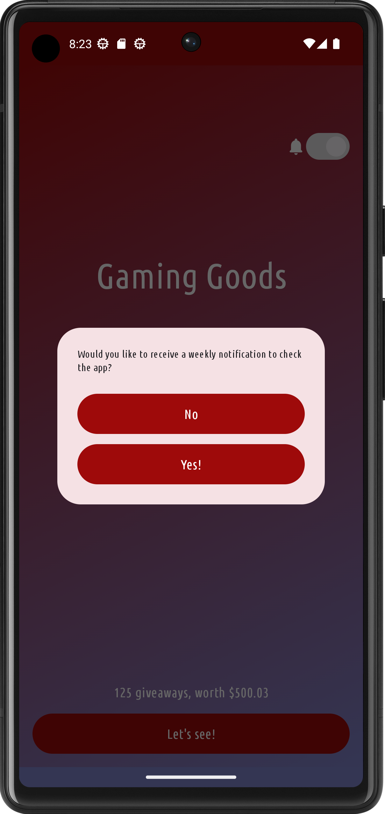
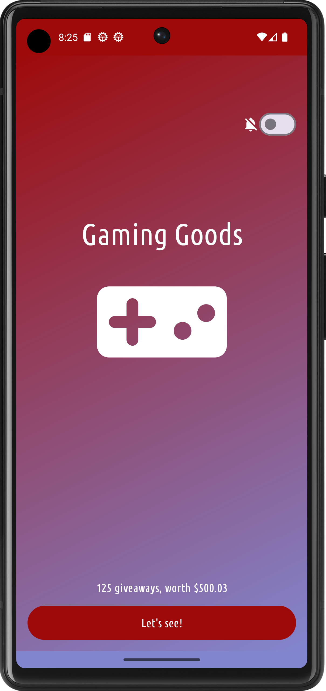
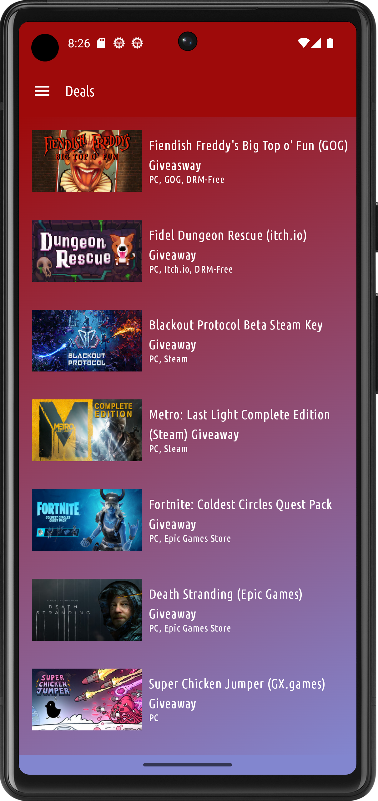
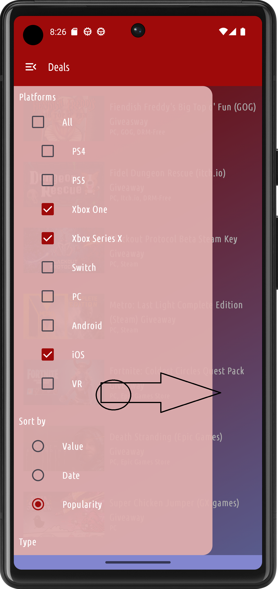
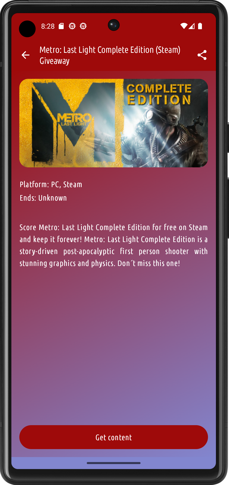
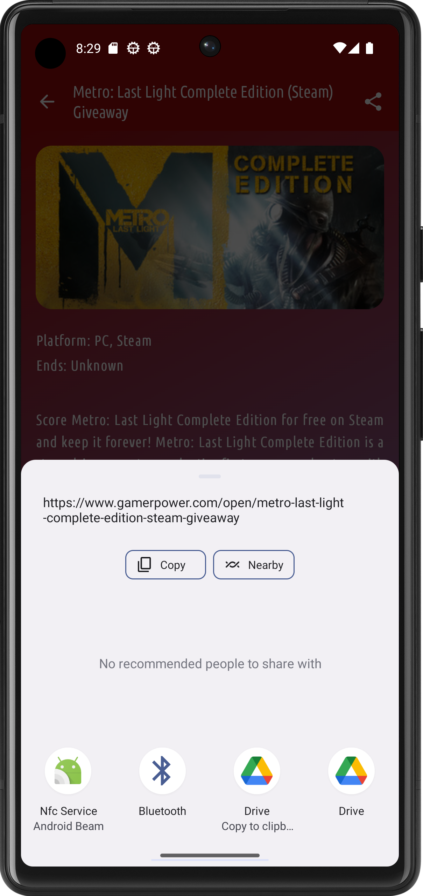
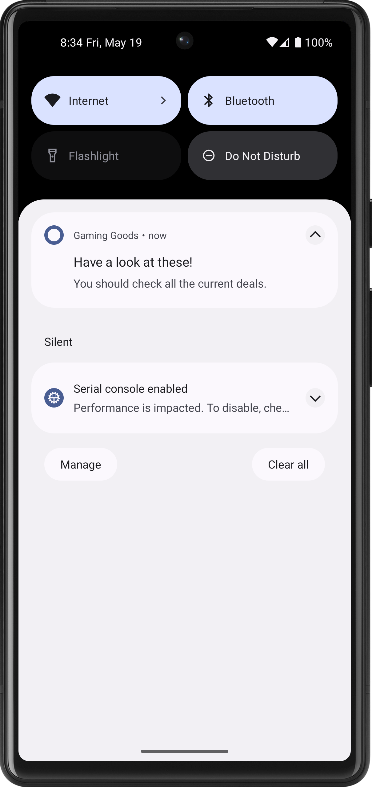

# Házi feladat specifikáció

Információk [itt](https://viauav21.github.io/laborok/hf)

## Androidalapú szoftverfejlesztés
### 2022/23 - 2. félév
### Jeges Gábor - (JCIRJL)
### jegesgabor2000@gmail.com 
### Laborvezető: Pomázi Krisztián

## Bemutatás

Az alkalmazás egy [GamerPower API](https://www.gamerpower.com/api-read) felhasználásával készülő app, amiben a felhasználó böngészheti a különböző akciókat.
Egy konkrét ajánlatra nyomva megnyitja a böngészőben az ahhoz tartozó oldalt, így a felhasználók azonnal be tudják gyűjteni az épp osztogatott játékokat, DLC-ket, egyéb játékbeli item-eket.
Az ötlet az előző féléves [mobweb házimból](https://github.com/jgbor/gaminggoods) származik, ezt szeretném Jetpack Composeba átírni View alapúról, továbbfejleszteni és profibbá tenni.

## Főbb funkciók

Az alkalmazásban lehetőség van platformok, illetve különböző szempontok (típus) szerint szűrni. A preferenciák mentésre kerülnek.
Egy konkrét ajánlatra nyomva megnézhetjük részletesebben az adatait. Valamint meg is oszthatjuk őket.
A részletes kérpernyőn egy gombra nyomva megnyílik a böngésző a játékhoz tartozó oldalon, ahol a felhasználók azonnal be tudják gyűjteni azt.
Hetente értesítésben emlékeztető, hogy nézzük meg az új akciókat.

## Választott technológiák:

- UI: A felhasználói felület Jetpack Compose-ban és MVVM architektúrával.
- Navigáció: A felhasználói felület navigációját Compose Navigation-nel oldom meg.
- Lista: Az akciók egy listában jelennek meg, ahol rájuk kattinthatunk, hogy több infót tudjunk meg róluk.
- Hálózatkezelés: Az alkalmazás a [GamerPower](https://www.gamerpower.com/api-read) nyílt API-t használja, és REST végponton keresztül tölti le a játékajánlatok adatait.
- Perzisztens adattárolás: A felhasználó preferenciáit DataStoreban tárolja az alaklmazás.
- Intent: a rendszernek jelez az alkalmazás, hogy a kért URL-t nyissa meg a böngészőben, valamint a megosztás is egy Intenttel történik.
- Notificationök: Az alkalmazás értesítést küld heti rendszerességgel, hogy nézzük meg az új akciókat.

___

# Házi feladat dokumentáció

### Gaming Goods

## Bemutatás

Az alkalmazás egy [GamerPower API](https://www.gamerpower.com/api-read) felhasználásával készülő app, amiben a felhasználó böngészheti a különböző akciókat.
Egy konkrét ajánlatra nyomva megnyitja a böngészőben az ahhoz tartozó oldalt, így a felhasználók azonnal be tudják gyűjteni az épp osztogatott játékokat, DLC-ket, egyéb játékbeli item-eket.
Az ötlet az előző féléves [mobweb házimból](https://github.com/jgbor/gaminggoods) származik, ezt Jetpack Composeba írtam át View alapúról, továbbfejlesztettem, új funkciókkal bővítettem.

## Főbb funkciók

Az alkalmazásban lehetőség van platformok, illetve különböző szempontok (típus) szerint szűrni. A preferenciák mentésre kerülnek.
Egy konkrét ajánlatra nyomva megnézhetjük részletesebben az adatait, valamint meg is oszthatjuk őket.
A részletes kérpernyőn egy gombra nyomva megnyílik a böngésző a játékhoz tartozó oldalon, ahol a felhasználók azonnal be tudják gyűjteni azt.
Hetente értesítésben emlékeztető, hogy nézzük meg az új akciókat.

## Felhasználói kézikönyv

1. ábra: Egy felugró üzenet (csak Android 13-tól felfele), ami megkérdezi a felhasználót, hogy szeretne-e értesítéseket kapni, ha igen, akkor meg kell adnunk az engedélyt.
Elutasítás esetén nem fogunk értesítéseket kapni, a jobb felső switch le lesz tiltva. Android 13-nál régebbi verziókon nem jelenik meg ez az üzenet, ott a switch alapértelmezetten be van kapcsolva.
A switchet kapcsolgatva, be- és kikapcsolhatjuk az értesítéseket, melyek a bekapcsolástól számítva mindig 1 hét elteltével fognak érkezni, illetve a készülék bekapcsolásakor.

2. ábra: A képernyő, ahol a játékajánlatokat láthatjuk. Az oldalsó menüben lehetőségünk van a platformok, illetve típus szerint szűrni, rendezés alapját választani.
A szűrés mentésre kerül, így a következő indításnál is ugyanazokat a beállításokat fogjuk látni. A menüt vagy a képrenyő bal felső sarkában lévő gombbal, vagy a képernyő bal széléről jobbra húzva tudjuk megnyitni.
Zárni a menün kívülre vagy a gombra kattintva, vagy a képernyő jobb széléről balra húzva tudjuk. Egy ajánlatra kattintva megnyílik a részletes képernyő.  

3. ábra: A részletes képernyő, ahol az ajánlat részleteit tekinthetjük meg.
A gombra kattintva megnyílik a játékhoz tartozó oldal a böngészőben, ahol a felhasználók azonnal be tudják gyűjteni azt.
A bal felső sarokban lévő gombbal visszatérhetünk az előző képernyőre, a jobb felső sarokban lévő gombbal pedig megoszthatjuk az ajánlatot.

4. ábra: Így néz ki egy értesítés, amit hetente fogunk kapni, ha engedélyeztük az értesítéseket. Rákattintva, elindul az alkalmazás.

## Felhasznált technológiák:

- Az alkalmazás **Jetpack Compose**-al készült
- **MVVM** architektúra
- A képernyők **fix álló** nézetűek
- **Material3** dizájn
- **Magyar és angol** nyelvű lokalizáció, a telefon nyelvétől függően
- **Font** erőforrások használata a szövegekhez
- **Compose Navigation** használata a képernyők közötti navigációhoz
- **[Retrofit](https://square.github.io/retrofit/)** használata a hálózati kommunikációhoz
- **[kotlinx serialization](https://kotlinlang.org/docs/serialization.html)** használata a JSON feldolgozásához
- **[Coil](https://coil-kt.github.io/coil/)** a képek letöltéséhez
- **[Dagger Hilt](https://developer.android.com/training/dependency-injection/hilt-android)** használata a függőségek injektálásához
- **[DataStore](https://developer.android.com/topic/libraries/architecture/datastore)** használata a lokális adattároláshoz
- **[Accompanist](https://google.github.io/accompanist/)** az engedélyek kéréséhez, illetve a rendszer Navigation Bar-jának és Status Bar-jának színének beállításához.
- **AlarmManager** használata az értesítések ütemezéséhez
- **NotificationManager** használata az értesítések küldéséhez
- **BroadcastReceiver** használata az AlarmManager jelzéseinek fogadásához, illetve a mobil újraindítása esetén a rendszer értesítéséhez, hogy újra be kell állítani az értesítéseket

## Fontosabb technológiai megoldások

Számomra a legnehezebb funkciók a következők voltak:

- **Beállítások menü:** A beállítások menüben a szűrési feltételek mentésére volt szükség, a RadioButton-öket könnyen meg tudtam valósítani, viszon a CheckBoxoknál úgy akartam,
hogy az összes bepipálásra kerüljön, ha a felhasználó rányom az all-ra, illetve vegye ki, ha újra rányom. Az érték megváltozott a DataStore-ban, de a képernyőn nem frissült vagy nem úgy működött, ahogy szerettem volna.
Ezért a CheckBoxok állapotát egy mutableSet-ben tároltam, és az átállításnál végigmegyünk az elemeken, és megfelelőre állítjuk.
- **Platform mentése:** Az előzőhöz még kapcsolódik, hogy a platformokat hogyan mentsem el. Először minden platformhoz külön booleanPrefencet hoztam részre és kiolvasásnál akartam megadni a megfelelő sztringet,
viszont nem ez lett a megfelelő megoldás, hanem, hogy a ViewModelben összerakom a szűrési feltétel sztringet, és azt ment el.
- **AlertDialog megjelenése:** API 33-tól értesítésekhez engedély szükséges, így AlertDialogot használtam, hogy kérjem be a felhasználó engedélyét, viszont meg kellett oldanom, hogy Android 13 alatt ne jelenjen meg, mert ott nem kell engedély.
Ezt a Build.VERSION.SDK_INT változó ellenőrzésével oldottam meg. Ehhez tartozik az is, hogy nemre nyomva többet ne jelenjen meg, illetve mellé nyomva, pedig legközeleebb ismét megjelenjen. Ezt egy DataStore boolean változóval oldottam meg.
- **DataStore kezdeti állapot:** Az egyik indításnál észrevettem, hogy mikor feltelepítjük az alkalmazást, akkor a DataStore-ban még null értékű minden, viszont így nem feltétlen megfelelő a UI, például az értesítés Switch ki volt kapcsolva,
pedig valójában már be volt kapcsolva. Második indításnál már létezett a DataStore-beli érték, így már megfelelően működött, ezért a DataStore-ban lévő notificationOn változót egy nullable változóvá tettem, és a ViewModelben ellenőriztem, hogy null-e, és ha igen,
akkor megfelőlen állítottam be a UI-hoz a state változóját.   